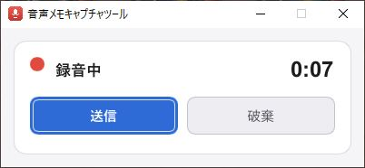

<p align="center">
  
</p>

# VoiceHook

起動すると即録音、ボタン一つでWebhookへ送信するWindows用の音声メモツール。

思いついたことをすぐ声で残したいとき、exeを起動した瞬間から録音が始まり、**Enterキー（またはボタン）を一度押すだけ**で音声がWebhookへPOSTされる。常駐しないので、1回の録音 = 1プロセスで完結する。

- **起動＝録音開始**。録音ボタンを探す必要がない。
- **送信先は任意のWebhook**。URLを`.env`に書くだけ（n8n・Make・自前サーバ等、何でもよい）。
- 音声は**Ogg Opus**（`audio/ogg`）に変換して送るため、無圧縮WAVより通信量が桁違いに少ない。
- Rust + Slint（ソフトウェアレンダラ）製。GPU初期化なしで軽快に立ち上がる。

## ダウンロード

[Releases](https://github.com/voltaney/VoiceHook/releases)から`VoiceHook-vX.Y.Z-windows-x64.zip`をダウンロードして解凍する（中身はexe・`.env.example`・`使い方.txt`）。自分でビルドする場合は[ビルド](#ビルド)を参照。

## 使い方

1. `VoiceHook.exe`と同じフォルダに`.env`を置く（[.env.example](.env.example)をコピーして編集）。
2. exeを起動する → その場で録音が始まる。
3. **Enter / Space**（または「送信」ボタン）で送信。**Esc**（または「破棄」）で捨てる。
   - 送信に成功するとウィンドウは自動で閉じる。
   - 失敗したときはエラー内容が表示され、「再送信」で録音を撮り直さずリトライできる。

## 設定（`.env`）

```
# 送信先 Webhook URL（必須）
WEBHOOK_URL=https://example.com/webhook/xxxxx

# Basic 認証（任意。不要なら空のままでよい）
BASIC_AUTH_USER=
BASIC_AUTH_PASS=

# 録音に使う入力デバイス名（任意。部分一致で検索）
# 空なら OS の既定の入力デバイスを使う。指定した場合、そのデバイスが未接続のときは
# 録音を開始せず「デバイスが見つかりません」と表示する（内蔵マイクでの誤録音防止）。
# スペースを含む値は必ず "..." で囲む
TARGET_DEVICE_NAME="Microphone (USB MICROPHONE)"

# 送信する Ogg Opus の目標ビットレート（kbps。任意・既定 64・範囲 6〜510）
AUDIO_BITRATE_KBPS=64
```

`.env`はexeと同じフォルダのものが最優先で読まれる（`cargo run`時はプロジェクトルート）。`.env`はコミットしないこと。

クエリパラメータを付けたい場合（`?source=pc`など）は、`WEBHOOK_URL`に直接含める。

## Webhookが受け取るリクエスト

| 項目            | 内容                                                                   |
| --------------- | ---------------------------------------------------------------------- |
| メソッド        | `POST`                                                                 |
| URL             | `WEBHOOK_URL`をそのまま使う                                            |
| `Content-Type`  | `audio/ogg`                                                            |
| ボディ          | Ogg Opusファイルの生バイナリ                                           |
| `Authorization` | `BASIC_AUTH_USER` / `BASIC_AUTH_PASS`が設定されているときのみBasic認証 |

HTTPステータス2xxを成功とみなす。

ボディはJSONではなく、Ogg Opusファイルの生バイナリである。実際に送出されるリクエストは以下のとおり。

```http
POST /webhook/XXXXXXXX HTTP/1.1
content-type: audio/ogg
authorization: Basic XXXXXXXXXXXXXXXX
content-length: 8396
accept: */*
host: example.com

OggS........OpusHead....（以降、content-lengthバイト分のバイナリ）
```

`authorization`は`BASIC_AUTH_USER`／`BASIC_AUTH_PASS`を設定した場合のみ付与される。
ボディのサイズは64kbpsで約8KB/秒（1分の録音でおよそ0.5MB）。受信側ではJSONとしてではなく、バイナリ（ファイル）として扱う。

## ビルド

必要環境: Windows / Rust（MSVCツールチェーン）/ **cmake**（`audiopus`がlibopusを同梱ビルドするため必須）。

```sh
cargo run              # 開発時の起動確認
cargo build --release  # リリースビルド（target/release/VoiceHook.exe）
```

### リリース

`Cargo.toml`の`version`がバージョンの正本で、exeのプロパティ（詳細タブ）にも埋め込まれる。
versionを上げてコミットし、同じ番号のタグ（`vX.Y.Z`）をpushすると、GitHub ActionsがWindows向けにビルドしてReleasesにzipを公開する。

## おまけ: ホットキーで起動する（任意）

毎回exeを探しに行くのが面倒なら、Windows標準のショートカット機能で起動キーを割り当てられる（アプリ側の設定は不要）。

1. `VoiceHook.exe`のショートカット（`.lnk`）を作る。
2. ショートカットのプロパティ →「ショートカットキー」に任意のキー（例: Ctrl+Alt+R）を設定する。
3. ショートカットをスタートメニューやタスクバーに置く。

これで、どのアプリを使っていてもキー一発で録音を始められる。

## ドキュメント

詳細な仕様は[docs/spec.md](docs/spec.md)、開発ルールは[CLAUDE.md](CLAUDE.md)を参照。
